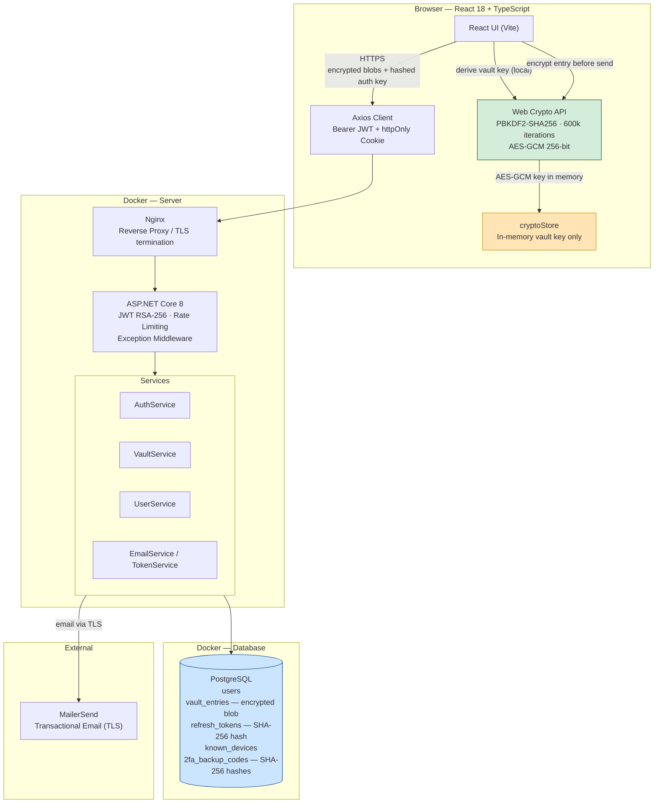
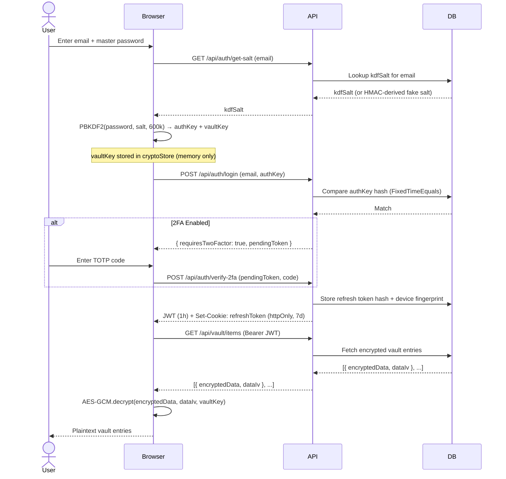
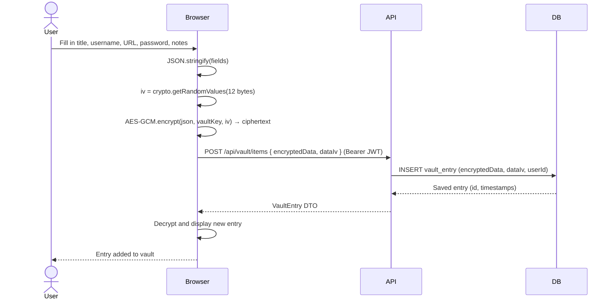
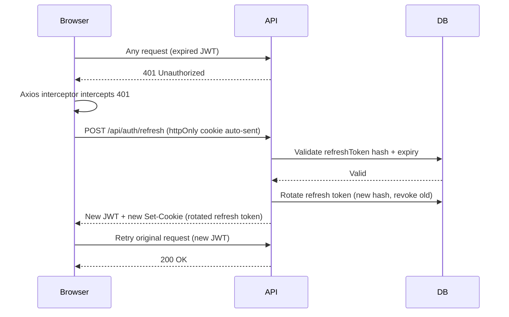
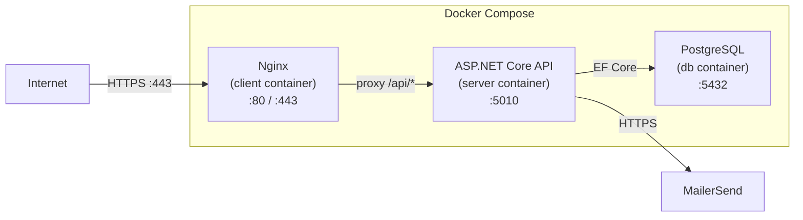

# Architecture

## System Overview

MyPasswordVault is a **zero-knowledge password manager** built on a client-server architecture. The critical design principle is that the server **never** processes or stores plaintext vault data. All encryption and decryption is performed exclusively in the browser.

---

## High-Level Architecture



> **Key property:** The vault key (derived from the master password) only ever exists in `cryptoStore` (browser memory). It is never sent to the server or persisted anywhere.

---

## Component Breakdown

### Client (Browser)

| Component | Responsibility |
|---|---|
| React UI | All user-facing pages and interactions |
| Web Crypto API | PBKDF2 key derivation + AES-GCM encryption/decryption |
| `cryptoStore` | Holds the 256-bit vault key in memory after login; cleared on logout/refresh |
| Axios Interceptors | Attaches JWT Bearer token; handles silent refresh on 401 responses |

**Build:** Vite → served by Nginx as a static SPA.

### Server (ASP.NET Core 8)

| Component | Responsibility |
|---|---|
| Nginx | Reverse proxy, TLS termination, static file serving |
| Controllers | HTTP routing (`/api/auth`, `/api/vault`, `/api/user`) |
| JWT Middleware | Validates RSA-256 signed access tokens on protected routes |
| Rate Limiter | Per-endpoint per-IP request limits (20–60 req/min) |
| ExceptionMiddleware | Translates custom exceptions to HTTP responses without leaking internals |
| AuthService | Registration, login, 2FA, email verification, password reset, device tracking |
| VaultService | CRUD for encrypted vault entries (no decryption ever happens here) |
| UserService | Account management, password/email change, account deletion |
| EmailService | Sends transactional emails via MailerSend API |
| TokenService | Generates and hashes all short-lived tokens |

### Database (PostgreSQL)

| Table | Sensitive columns | How protected |
|---|---|---|
| `users` | `PasswordHash`, `kdfSalt` | PBKDF2 output; never plaintext password |
| `users` | `TwoFactorSecret` | Base32 TOTP secret; DB access required to exploit |
| `vault_entries` | `EncryptedData`, `DataIv` | AES-GCM ciphertext; useless without vault key |
| `refresh_tokens` | `TokenHash` | SHA-256 hash only |
| `2fa_backup_codes` | `CodeHash` | SHA-256 hash only |
| `users` | `EmailVerificationToken`, `PasswordResetToken`, etc. | SHA-256 hash only |

---

## Data Flow Diagrams

### Login & Vault Unlock



### Add Vault Entry



### Token Refresh



---

## Deployment Architecture



| Container | Image | Exposed port |
|---|---|---|
| client | nginx:alpine + React SPA | 80, 443 |
| server | mcr.microsoft.com/dotnet/aspnet:8.0 | 5010 (internal) |
| db | postgres:latest | 5432 (internal) |

---

## Security Boundaries

```
┌─────────────────────────────────────────────────────────────────┐
│  TRUST BOUNDARY: Browser (user controlled)                      │
│                                                                 │
│  • Master password lives here only                              │
│  • Vault key (AES-256) lives here only                          │
│  • Plaintext vault data lives here only                         │
│                                                                 │
└────────────────────────┬────────────────────────────────────────┘
                         │  HTTPS — only ciphertext crosses this boundary
                         ▼
┌─────────────────────────────────────────────────────────────────┐
│  TRUST BOUNDARY: Server (operator controlled)                   │
│                                                                 │
│  • Sees: encrypted blobs, hashed auth key, hashed tokens        │
│  • Never sees: master password, vault key, plaintext entries    │
│                                                                 │
│  ┌───────────────────────────────────────────┐                 │
│  │  TRUST BOUNDARY: Database                 │                 │
│  │  • Encrypted vault entries                │                 │
│  │  • Hashed tokens (SHA-256)                │                 │
│  │  • Hashed password (PBKDF2)               │                 │
│  └───────────────────────────────────────────┘                 │
└─────────────────────────────────────────────────────────────────┘
```
